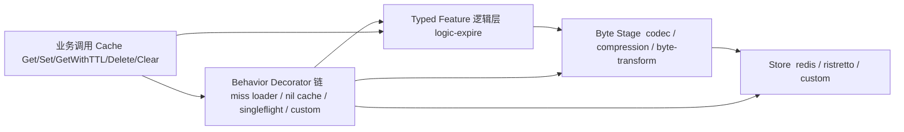

# 架构和装饰器链路说明

本文说明 `cachalot` 单缓存能力的核心架构：`Store`、`Factory`、`Decorator` 的职责边界，以及 Builder 的阶段化装配顺序。

## 1. 总体架构



 


分层职责：

- `Behavior Decorator`：只关注“如何用缓存”（并发收敛、回源、防击穿、观测等），不关注底层存储类型。
- `Typed Feature`：对强类型值做语义增强（当前为逻辑过期）。
- `Byte Stage`：对字节流做线性转换（`TypeAdapter`、`Codec`、`Compression`、未来加密等）。
- `Factory`：负责把 `Store` 绑定到 pipeline 的最内层缓存。
- `Store`：对具体存储客户端的最小封装，提供统一读写语义。

## 2. 核心抽象

### Cache 接口（业务侧）

```go
// core/cache/cache.go
type Cache[T any] interface {
    Get(ctx context.Context, key string, opts ...CallOption) (T, error)
    Set(ctx context.Context, key string, val T, ttl time.Duration, opts ...CallOption) error
    GetWithTTL(ctx context.Context, key string, opts ...CallOption) (T, time.Duration, error)
    Delete(ctx context.Context, key string, opts ...CallOption) error
    Clear(ctx context.Context) error
}
```

### Store 接口（存储侧）

```go
// core/cache/store.go
type Store interface {
    Get(ctx context.Context, key string, opts ...CallOption) (any, error)
    Set(ctx context.Context, key string, val any, ttl time.Duration, opts ...CallOption) error
    GetWithTTL(ctx context.Context, key string, opts ...CallOption) (any, time.Duration, error)
    Delete(ctx context.Context, key string, opts ...CallOption) error
    Clear(ctx context.Context) error
    StoreName() string
}
```

### Factory / Decorator 抽象

```go
// core/cache/option.go
type CacheFactory[T any] func(Store, *telemetry.Observable) (Cache[T], error)
type Decorator[T any] func(Cache[T], *telemetry.Observable) (Cache[T], error)
```

### 可观测性抽象

```go
// core/telemetry/logger.go
type Logger interface {
    DebugContext(ctx context.Context, msg string, args ...any)
    InfoContext(ctx context.Context, msg string, args ...any)
    WarnContext(ctx context.Context, msg string, args ...any)
    ErrorContext(ctx context.Context, msg string, args ...any)
}

// core/telemetry/metrics.go
type Metrics interface {
    Record(context.Context, *Event) error
}
```

## 3. 装饰器链执行模型

`core/cache.New` 的装配流程（见 `core/cache/cache.go`）：

1. 应用所有 `Option`，得到 `factory` 与 `decorators`。
2. 先执行 `factory(store, ob)` 得到最内层 cache。
3. 按 `decorators` 的顺序逐个包裹。

注意：后追加的 decorator 在更外层。

- 若顺序是 `d1, d2, d3`，最终结构是 `d3(d2(d1(base)))`。

## 4. Builder 模式的阶段化装配

`NewBuilder`（根目录 `cache.go`）默认行为：

- 默认启用 `singleflight`（可用 `WithSingleFlight(false)` 关闭）。
- 默认 `metrics`：`telemetry.NoopMetrics()`。
- 默认 `logger`：`telemetry.SlogLogger()`。
- 默认观测装饰器：`decorator.NewObservableDecorator`。
- 默认不启用字节转换链。

`Build()`（根目录 `cache.go`）会按以下步骤组装：

1. 先编译 Factory（阶段化）：
   - 决定是否走 byte-stage（`codec/type-adapter/byte-transform`）。
   - 应用 `ByteTransform` 链（如 compression）。
   - 连接 `TypeAdapter`（`T <-> []byte`）。
   - 应用 typed feature（logic-expire）。
2. 追加 behavior decorators：miss-loader -> nil-cache -> singleflight。
3. 调用 `cache.New(...)`，按 Option 顺序注入：
   - `WithObservable(...)`
   - `factory`
   - `WithOptions(b.decorators...)`
   - `obDecorators`
   - `WithOptions(b.options...)`

因此默认情况下，最外层是观测层；如果在 `WithOptions` 里再传 `WithDecorator`，该装饰器会在观测层外侧。

## 5. 如何扩展

### 自定义 Decorator

```go
type Decorator[T any] func(cache Cache[T], ob *telemetry.Observable) (Cache[T], error)
```

- Low-level：通过 `cache.WithDecorator(...)` 传入 `cache.New`。
- Builder：通过 `WithDecorators(...)` 传入。

建议：行为型 Decorator 只做单一职责；类型转换和字节转换进入 stage pipeline。

### 自定义 Factory

- Low-level：`cache.WithFactory(...)`。
- Builder：`WithFactory(...)`。

`WithFactory`/`WithCustomPlan` 与 staged feature（`codec/logic-expire/compression/type-adapter`）互斥，同时开启会报错。

## 6. 选型建议

- 追求开箱即用：优先 `NewBuilder`。
- 需要精确控制链路顺序和每层语义：使用 `core/cache.New + WithFactory/WithDecorator` 手工编排。
- 团队已有日志/指标系统：实现 `telemetry.Logger` 和 `telemetry.Metrics` 后接入。
