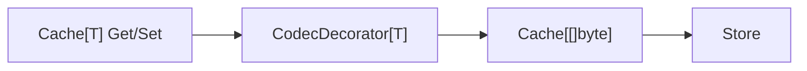

# Codec

`Codec` 用于把 `T` 和 `[]byte` 做双向转换，适配字节型存储（例如 Redis）。

## 1. 适用场景

- `Store` 底层只接受 `[]byte`。
- 业务使用强类型 `Cache[T]`，不希望在业务层手写序列化。

## 2. 核心接口

```go
// core/codec/codecs.go
type Codec interface {
    Marshal(any) ([]byte, error)
    Unmarshal([]byte, any) error
}
```

内置实现：

- `codec.JSONCodec`
- `codec.GobCodec`

## 3. 执行链路



`core/decorator/codec.go` 的行为：

- `Set`：先 `Marshal(T)->[]byte`，再写入内层 cache。
- `Get/GetWithTTL`：先从内层拿 `[]byte`，再 `Unmarshal` 成 `T`。

## 4. Builder 用法

```go
builder, err := cachalot.NewBuilder[User]("user-cache", store)
if err != nil {
    panic(err)
}

c, err := builder.
    WithCodec(codec.JSONCodec{}).
    Build()
```

### 和逻辑过期一起使用

当同时启用 `WithCodec` + `WithLogicExpire*` 时，Builder 会组装：

- `BaseCache[[]byte]`
- `CodecDecorator[LogicTTLValue[T]]`
- `LogicTTLDecorator[T]`

即先编解码逻辑过期结构，再做逻辑过期判断。

## 5. Low-level 自定义

```go
cache.New[T](name, store,
    cache.WithFactory(func(s cache.Store, _ *telemetry.Observable) (cache.Cache[T], error) {
        base := cache.NewBaseCache[[]byte](s)
        return &decorator.CodecDecorator[T]{
            Cache: base,
            Codec: myCodec,
        }, nil
    }),
)
```

## 6. 注意事项

- `Unmarshal` 失败会直接返回错误，不会吞错。
- `Codec` 选择要考虑兼容性和性能（跨版本字段变更、序列化开销）。
- 若你用 `WithFactory(...)` 自定义工厂，会覆盖 Builder 的 codec 自动组装逻辑。
