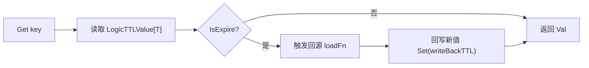

# 逻辑过期（Logic Expire）

逻辑过期的目标是：缓存数据过期后先返回旧值，再后台刷新，降低瞬时抖动和击穿风险。

## 1. 核心模型

逻辑过期不等于物理过期。

- 物理过期：由 `Store` 的 TTL 控制，过期后数据直接消失。
- 逻辑过期：值里带 `ExpireAt`，即使物理上还在，也可判定“已过期”。

```go
// core/decorator/logic_expire.go
type LogicTTLValue[T any] struct {
    Val      T
    ExpireAt time.Time
}
```

## 2. 执行链路



当前实现（`core/decorator/logic_expire.go`）语义：

- `Get` 命中后如果逻辑过期，会触发 `onExpire`，然后返回旧值 `Val`。
- `onExpire` 内部调用 `loadFn` 回源，并把新值按 `writeBackTTL` 回写。
- 回源或回写失败只记录日志，不影响本次 `Get` 返回旧值。

## 3. Builder 用法

```go
builder, err := cachalot.NewBuilder[User]("user-cache", store)
if err != nil {
    panic(err)
}

c, err := builder.
    WithLogicExpireDefaultLogicTTL(30 * time.Second).
    WithLogicExpireLoader(loadUser).
    WithLogicExpireDefaultWriteBackTTL(time.Minute).
    Build()
```

默认值（`NewBuilder`）：

- `defaultLogicTTL = 10 * time.Minute`
- `defaultWriteBackTTL = 1 * time.Hour`

## 4. 参数语义

- `WithLogicExpireDefaultLogicTTL(d)`：逻辑过期时间，要求 `d >= 0`。
- `WithLogicExpireDefaultWriteBackTTL(d)`：回写时物理 TTL，要求 `d >= 0`。
- `WithLogicExpireLoader(fn)`：逻辑过期后的回源函数。
- `WithLogicExpireEnabled(true)`：显式开关。

## 5. 组合规则
- 当 `WithLogicExpire...` 且启用 byte-stage 时：
  - `T == []byte`：当 `WithLogicExpire...` 且启用 byte-stage 时，当前要求配置 `WithLogicExpireBytesAdapter` 以启用 `LogicTTLValue[T] <-> []byte` 的内置支持，此时不需要使用 `WithCodec(...)`。
  - `T != []byte`：需要 `WithCodec(...)` 适配 `LogicTTLValue[T] <-> []byte`。

## 6. 关键注意事项

- `GetWithTTL` 返回的是物理 TTL，不是逻辑 TTL。
- `defaultLogicTTL=0` 时，`ExpireAt` 为零值，表示逻辑上永不过期。
- 如果使用了 `WithLogicExpireBytesAdapter`，内置支持是将过期时间编码为八个字节，写入字节数组的头部，如果对 value 大小有严格限制，则不应使用此内置支持或开启此功能

## 7. 指标扩展点

如果你的 `Metrics` 还实现了：

```go
type LogicTTLMetrics interface {
    RecordLogicExpire(ctx context.Context)
}
```

逻辑过期触发时会调用该方法，可用于单独统计“逻辑过期刷新次数”。
