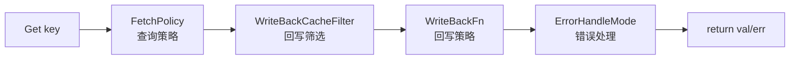

# 多级缓存原理

本文对应 `cachalot` 的多级缓存实现（`MultiBuilder` + `core/multicache`），重点说明多级缓存为何存在、运行链路、默认策略和可扩展点。

## 1. 为什么需要多级缓存

多级缓存不是“单级缓存的升级版”，而是解决单级缓存难以同时满足的目标：

- 更高可用性：通过异构缓存冗余，降低单一中间件故障风险。
- 更低延迟：L1（本地缓存）优先命中，L2（远端缓存）兜底，减少网络 IO。
- 更强可控性：把“怎么查”“回写哪些”“怎么回写”“回写失败怎么办”拆成独立策略。

## 2. 总体链路



多级缓存 `Get` 是四阶段流水线：

1. `FetchPolicy`：从多个 cache / loader 获取值，并返回失败的缓存列表。
2. `WriteBackCacheFilter`：从失败缓存里筛出需要回写的目标。
3. `WriteBackFn`：执行回写。
4. `ErrorHandleMode`：决定回写失败时返回值是“严格失败”还是“容忍成功”。

## 3. 核心接口

```go
// core/multicache/multi_cache.go
type MultiCache[T any] interface {
    Get(ctx context.Context, key string, opts ...cache.CallOption) (T, error)
    Set(ctx context.Context, key string, val T, ttl time.Duration, opts ...cache.CallOption) error
    Delete(ctx context.Context, key string, opts ...cache.CallOption) error
    Clear(ctx context.Context) error
    Caches() []cache.Cache[T]
    FetchByLoader(ctx context.Context, key string) (T, error)
    Logger() telemetry.Logger
    Metrics() telemetry.Metrics
}
```

```go
// core/multicache/fetch_policy.go
type FetchPolicy[T any] func(ctx context.Context, getCtx *FetchContext[T]) (T, []FailedCache[T], error)

// core/multicache/write_back_filter.go
type WriteBackCacheFilter[T any] func(ctx context.Context, getCtx *FetchContext[T], failedCaches []FailedCache[T]) []cache.Cache[T]

// core/multicache/write_back.go
type WriteBackFn[T any] func(ctx context.Context, getCtx *FetchContext[T], caches []cache.Cache[T]) error
```

```go
// core/multicache/error_handle.go
const (
    ErrorHandleStrict   ErrorHandleMode = iota // 回写失败 -> Get 失败
    ErrorHandleTolerant                        // 回写失败 -> 记录日志后仍返回已获取值
)
```

## 4. 默认配置（NewMultiBuilder）

`NewMultiBuilder`（根目录 `multi_cache.go`）默认行为：

- `FetchPolicy = multicache.FetchPolicySequential[T]`
- `WriteBackCacheFilter = multicache.MissedCacheFilter[T]`
- `WriteBackFn = multicache.WriteBackParallel[T](time.Minute)`
- `ErrorHandleMode = multicache.ErrorHandleTolerant`
- `singleflight loader = true`
- `metrics = telemetry.NoopMetrics()`
- `logger = telemetry.SlogLogger()`
- 默认要求提供 `WithLoader(...)`（可用 `WithLoaderFnNotNil(false)` 关闭检查）

默认策略含义：

- 读取时按 cache 顺序查找，全部失败后调用 loader。
- 回写只针对 `ErrNotFound` 的缓存，不回写调用失败的缓存（避免放大故障）。
- 回写并行执行，默认 TTL 为 1 分钟。
- 回写失败默认不影响读取结果（tolerant）。

## 5. Get 执行语义

`core/multicache/multi_cache.go` 中 `Get` 的关键语义：

1. `FetchPolicy` 返回 `val + failedCaches`。
2. `WriteBackCacheFilter` 决定回写目标缓存。
3. `WriteBackFn` 执行回写。
4. 若回写出错：
   - `Strict`：直接返回错误。
   - `Tolerant`：记录日志并返回已获取到的值。

注意：`MultiCache` 故意不提供 `GetWithTTL`，因为多级场景里 TTL 语义不明确（来自哪个层级）。

## 6. 可扩展点

### 自定义查询策略

通过 `WithFetchPolicy(...)`，你可以实现：

- “先远端后本地”或“先 loader 后 cache”的策略。
- 附带重试、熔断、超时的策略。
- 业务优先级驱动的策略（特定 key 走特定缓存层）。

### 自定义回写筛选与回写动作

- `WithWriteBackFilter(...)`：定义“哪些失败缓存应回写”。
- `WithWriteBack(...)`：定义“如何回写”（并行/串行/异步/分级 TTL）。

仓库还提供了一个写回构建助手：

- `core/multicache/write_back/builder.go`
- 支持默认并行回写、自定义回写函数、异步执行、错误回调。

### 自定义错误处理

- `WithErrorHandling(multicache.ErrorHandleStrict)`：回写失败即失败。
- `WithErrorHandling(multicache.ErrorHandleTolerant)`：回写失败不影响读成功。

## 7. 推荐实践

- L1+L2 组合：`ristretto(local) + redis(remote)`。
- 强一致需求高：使用 `Strict`，并谨慎设置回写策略。
- 可用性优先：使用 `Tolerant`，并配合指标告警监控回写失败率。
- 如果 `FetchPolicy` 不依赖 loader，记得 `WithLoaderFnNotNil(false)`。
