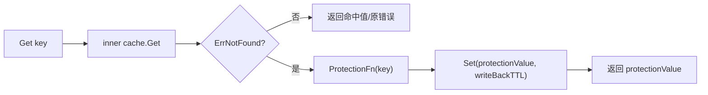

# Nil Cache（防缓存击穿）

`NilCacheDecorator` 用于在缓存未命中时写入“防护值”，减少同类不存在 key 持续穿透到下游。

## 1. 适用场景

- 大量不存在 key 被反复查询。
- 下游（DB/服务）无法承受持续 miss 带来的压力。

## 2. 核心接口

```go
// core/decorator/nil_cache.go
type ProtectionFn[T any] func(key string) T
```

- 当 `ErrNotFound` 时，调用 `ProtectionFn` 生成占位值并写回缓存。

## 3. 执行链路



`GetWithTTL` 语义：

- 未命中触发防护后返回 `(protectionValue, writeBackTTL, nil)`。

## 4. Builder 用法

```go
builder, err := cachalot.NewBuilder[User]("user-cache", store)
if err != nil {
    panic(err)
}

c, err := builder.
    WithNilCacheFn(func(key string) User {
        return User{ID: key, IsPlaceholder: true}
    }).
    WithNilCacheWriteBackTTL(30 * time.Second).
    Build()
```

默认值（`NewBuilder`）：

- `nilCache.defaultWriteBackTTL = 1 * time.Hour`

## 5. 和其他特性的顺序

Builder 中的默认顺序是：

1. `MissedLoaderDecorator`（如果配置）
2. `NilCacheDecorator`（如果配置）
3. `SingleflightDecorator`（默认开启）

这意味着：

- 有 miss-loader 时，`ErrNotFound` 往往先被 loader 处理并回写，nil-cache 只处理 loader 仍 miss 的情况。
- Singleflight 在外层，可减少同 key 并发触发防护写回。

## 6. 注意事项

- `ProtectionFn` 的返回值应能被业务识别为占位值，避免误当成真实数据。
- `writeBackTTL` 不宜过长，否则占位值可能长期污染读路径。
- `writeBackTTL < 0` 会在 Builder 校验时报错。
- 该特性主要解决“击穿/穿透流量放大”，不解决数据一致性问题。
